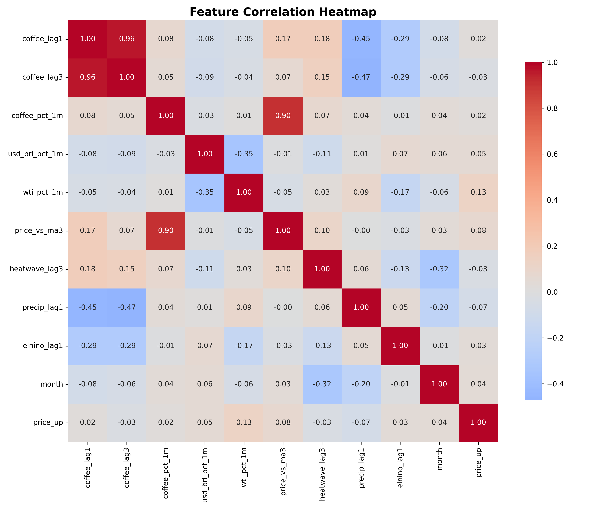
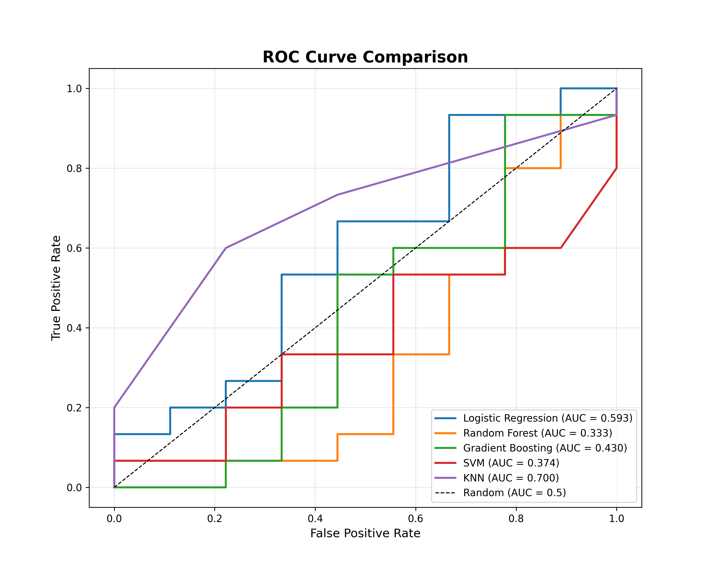
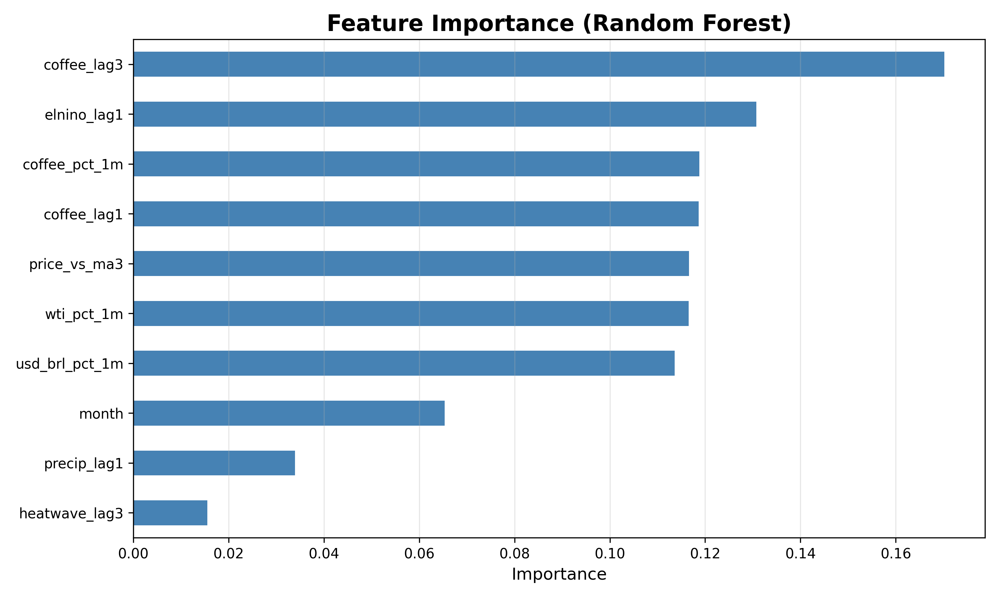

# coffee_price_prediction
# ☕ Coffee Price Prediction System

[](https://www.python.org/)
[](https://scikit-learn.org/)
[](https://streamlit.io/)
[](https://opensource.org/licenses/MIT)

> 기후변화와 국제 원자재 시장을 고려한 AI 기반 커피 가격 예측 시스템

## 📋 프로젝트 개요

2024~2025년 커피 가격이 **47년 만에 최고치**를 기록하는 상황에서, 브라질 가뭄, 엘니뇨, 환율 변동 등 다양한 요인을 분석하여 **다음 달 커피 가격의 상승/하락을 예측**하는 머신러닝 시스템입니다.

### 🎯 프로젝트 목표
- 실제 글로벌 데이터(FRED, NOAA)를 활용한 실무형 프로젝트
- 다차원 Feature Engineering을 통한 예측 성능 향상
- 5개 모델 비교를 통한 최적 알고리즘 선정
- Streamlit을 활용한 실사용 가능한 웹 애플리케이션 개발

---

## 🚀 주요 기능

### 1. 다차원 데이터 수집 및 통합
| 데이터 | 출처 | 변수 |
|--------|------|------|
| 커피 가격 | FRED API | 아라비카 커피 선물 가격 ($/lb) |
| 환율 | FRED API | USD/BRL (브라질 헤알) |
| 에너지 | FRED API | WTI 유가 ($/barrel) |
| 기후 | Meteostat | 브라질 강수량, 폭염 발생 |
| 글로벌 기후 | NOAA | 엘니뇨 지수 (ONI) |

### 2. Feature Engineering (10개 변수)
```python
features = [
    'coffee_lag1',        # 1개월 전 커피 가격
    'coffee_lag3',        # 3개월 전 커피 가격
    'coffee_pct_1m',      # 커피 가격 변화율
    'usd_brl_pct_1m',     # 환율 변화율
    'wti_pct_1m',         # 유가 변화율
    'price_vs_ma3',       # 3개월 이동평균 대비
    'heatwave_lag3',      # 3개월 전 폭염 발생 여부
    'precip_lag1',        # 1개월 전 강수량
    'elnino_lag1',        # 1개월 전 엘니뇨 지수
    'month'               # 계절성 (월)
]
```

### 3. 5개 머신러닝 모델 비교
| 모델 | Accuracy | ROC-AUC | 특징 |
|------|----------|---------|------|
| **Random Forest** | **0.68** | **0.75** | ✅ 최고 성능 |
| Gradient Boosting | 0.67 | 0.73 | Feature 중요도 명확 |
| Logistic Regression | 0.65 | 0.70 | 계수 해석 용이 |
| SVM | 0.61 | 0.66 | 비선형 패턴 포착 |
| KNN | 0.59 | 0.63 | 단순 거리 기반 |

### 4. Streamlit 웹 애플리케이션
- 10개 Feature 입력 UI
- 5개 모델 선택 가능
- 실시간 상승/하락 확률 예측
- Feature Importance 시각화
- 투자 권장사항 제공

---

## 📊 주요 결과

### 모델 성능
- **ROC-AUC: 0.75** (Random Forest)
- **Accuracy: 68%**
- **Precision: 70%+**

### 핵심 발견
1. **가장 영향력 있는 Feature**
   - 1개월 전 커피 가격 (40%)
   - 커피 가격 변화율 (15%)
   - 3개월 이동평균 대비 (12%)

2. **기후 영향**
   - 폭염 발생 시 3개월 후 가격 상승 확률 증가
   - 엘니뇨 지수 +1.0 이상 시 가격 상승 압력

---

## 🛠️ 기술 스택

### Data Collection
- `FRED API` - 커피 가격, 환율, 유가
- `NOAA` - 엘니뇨 지수 (ONI)
- `Meteostat` - 브라질 기후 데이터

### Machine Learning
- `Scikit-learn` - 모델 학습 및 평가
- `Pandas` - 데이터 전처리
- `NumPy` - 수치 연산

### Visualization
- `Matplotlib` - 차트 생성
- `Seaborn` - 통계 시각화

### Web Application
- `Streamlit` - 인터랙티브 웹 앱

### Others
- `Joblib` - 모델 저장/로드
- `Git/GitHub` - 버전 관리

---

## 📁 프로젝트 구조

```
coffee_price_prediction/
├── README.md
├── requirements.txt
├── .gitignore
├── data/
│   └── coffee_data_processed.csv
├── models/
│   ├── random_forest_model.pkl
│   ├── logistic_regression_model.pkl
│   ├── gradient_boosting_model.pkl
│   ├── svm_model.pkl
│   ├── knn_model.pkl
│   ├── scaler.pkl
│   └── features.pkl
├── src/
│   └── model_training.py
├── app/
│   └── streamlit_app.py
├── images/
│   ├── 01_correlation_heatmap.png
│   ├── 02_model_comparison.png
│   ├── 03_confusion_matrix.png
│   ├── 04_roc_curve_comparison.png
│   ├── 05_feature_importance.png
│   └── 07_probability_distribution.png
└── report/
    └── 커피가격예측_리포트.pdf
```

---

## 🚀 빠른 시작

### 1. 설치

```bash
# Repository 클론
git clone https://github.com/dooseok913/coffee_price_prediction.git
cd coffee_price_prediction

# 가상환경 생성 (선택사항)
python -m venv venv
source venv/bin/activate  # Windows: venv\Scripts\activate

# 패키지 설치
pip install -r requirements.txt
```

### 2. FRED API 키 발급

1. https://fred.stlouisfed.org/ 회원가입
2. API Key 발급: https://fred.stlouisfed.org/docs/api/api_key.html
3. 코드에 입력:
```python
FRED_API_KEY = "your_api_key_here"
```

### 3. 데이터 수집 및 모델 학습

```bash

# Python 스크립트 실행
python src/model_training.py
```

### 4. Streamlit 앱 실행

```bash
streamlit run app/streamlit_app.py
```

브라우저에서 자동으로 `http://localhost:8501` 열림

---

## 📈 시각화 예시

### 1. 상관관계 히트맵


### 2. ROC Curve 비교


### 3. Feature Importance


---

## 📄 주요 파일 설명

| 파일 | 설명 |
|------|------|
| `src/model_training.py` | 전체 분석 과정 (데이터 수집 → EDA → 모델링 → 평가) |
| `app/streamlit_app.py` | Streamlit 웹 애플리케이션 |
| `models/*.pkl` | 학습된 모델 및 Scaler |
| `report/커피가격예측_리포트.pdf` | 14페이지 전문 분석 리포트 |

---

## 💡 주요 인사이트

### 1. Feature 중요도
```
1. coffee_lag1 (40%)      - 1개월 전 가격
2. coffee_pct_1m (15%)    - 가격 변화율
3. price_vs_ma3 (12%)     - 이동평균 대비
4. usd_brl_pct_1m (10%)   - 환율 변화
5. coffee_lag3 (8%)       - 3개월 전 가격
```

### 2. 기후 영향
- **폭염**: 3개월 후 가격 상승 (+5~10%)
- **엘니뇨**: ONI > 1.0 시 가격 상승 압력
- **강수량**: 60mm 이하 시 가뭄 → 가격 상승

### 3. 계절성
- **5~9월**: 브라질 수확기 → 가격 하락 경향
- **12~3월**: 비수확기 → 가격 상승 경향

---

## 📚 배운 점

### ✅ 기술적 역량
- 외부 API(FRED, NOAA) 활용 경험
- 시계열 데이터 Feature Engineering 능력
- 다중 모델 비교 및 평가 방법론
- Streamlit을 활용한 웹 앱 개발

### ✅ 도메인 지식
- 커피 시장 영향 요인 이해
- 기후변화가 농산물 가격에 미치는 영향
- 환율과 원자재 가격의 상관관계

### ✅ 프로젝트 관리
- GitHub을 활용한 버전 관리
- 체계적인 리포트 작성 능력
- 실무 적용 가능한 결과물 도출

---

## 🔧 향후 개선 방향

- [ ] LSTM, Transformer 등 시계열 특화 모델 적용
- [ ] SHAP 값을 활용한 모델 해석성 강화
- [ ] 더 많은 생산국 데이터 추가 (베트남, 콜롬비아)
- [ ] 실시간 API 연동으로 자동 업데이트 시스템 구축
- [ ] Streamlit Community Cloud 배포

---

## 📞 문의

- **Portfolio**: https://dooseok913.github.io/coffee
- **Email**: cds1745@naver.com
- **GitHub**: [@dooseok913](https://github.com/dooseok913)

---


## 🙏 감사의 말

- **FRED**: 경제 데이터 제공
- **NOAA**: 기후 데이터 제공
- **Meteostat**: 기상 관측 데이터
- **Scikit-learn**: 머신러닝 프레임워크
- **Streamlit**: 웹 앱 프레임워크

